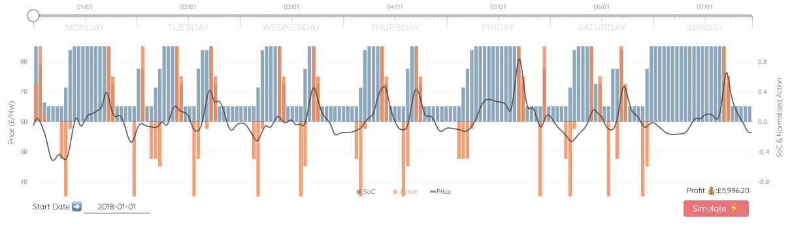
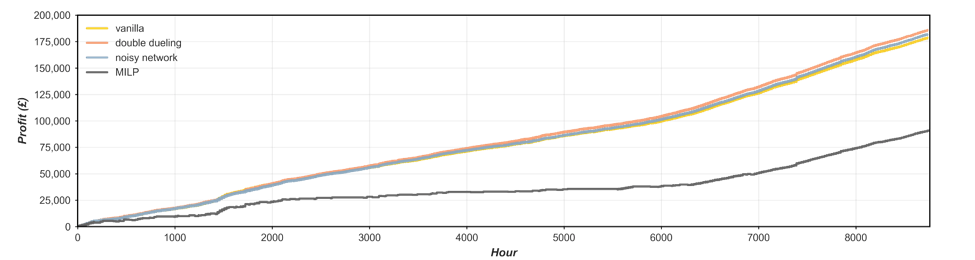

# Optimising Grid-Scale Lithium-ion Batteries with Deep Reinforcement Learning (DRL)
:rocket: Blog post on personal website :link: [Deep Reinforcement Learning for Grid Scale Lithium-ion Battery Optimisation](https://richardfindlay.co.uk/deep-reinforcement-learning-for-grid-scale-lithium-ion-battery-optimisation-3)


*screenshot of interactive d3.js plot illustrating timeseries performance of Double-Dueling DQN*

### Project Description :open_book::
The repository demonstrate the capabilities of data driven techniques by investigating the novel application of Deep Reinforcement Learning (DRL) to maximising the profit of a battery from wholesale energy arbitrage. Largely based on the codeless academic paper from [Cao et al. (2019)](https://eprints.keele.ac.uk/8408/1/final_submitted_energy_storage_arbitrage_using_DRL%20(7).pdf), the post looks to apply the deep Q-network (DQN) model introduced by DeepMind in 2015, as well as investigate some the improvements made to the basic architecture. The above figure shows the results from a 10MW/20MWh Li-ion battery optimised using a "Double Dueling" DQN method.

### Performance Overview :racing_car::
Vanilla, Double-Dueling and a Noisy Network DQN was explored as part of this study, integrating the effects of battery degradation and dynamic efficiency into the reward function to produce a pratical foundation to the novel optimisation. For comparison the repository also has a Mixed Integer Linear Programming (MILP) optimisation, with the cumulative profits for the inference year (2019) illustrated below. 



The Double-Dueling DQN marginally prevailed as the best optimisation technique in the energy arbitrage problem, with even the vanilla DQN agent shown significant uplift over other techniques such as MILP, the oppurtunties for DRL to such a problem is vast, epseically considering the minimal hyper-parameter tuning explored for this novel investigation.

### Notes on Code :notebook::
Install python dependencies for repository:
```
$ pip install -r requirements.txt
```

:weight_lifting: Training for all models was conducted on a Google Colab Pro+ subscription.

###  Further Work :telescope:: 
- [ ] Investigate oppurtunties for stackable revenue streams (Balancing Mechanism, FFR etc.) to be integrated into DQN optimisation.
- [ ] Imply battery sizing during training of DQN model -possibly within the state space- to allow for easier manipulation of configuration scenarios during inference.
- [ ] Opting for a different DRL architectures could allow for the adoption of a continuous action space which could bring about further opportunities for refined performance.
- [ ] Pursuit of temporally higher resolution data to better capture market volatility and arbitrage opportunities for batter

### Oppurtunties & To Do :test_tube:: 
- [ ] Code links and references to be validated since re-organisation.
- [ ] Expanding train-set out-with 1-year (2018) could promote performance.
- [ ] Further validate performance of Pytorch forecasting model and it's integration into the RL environment.

### Resources :gem:: 

+ [https://eprints.keele.ac.uk/id/eprint/8408/1/final_submitted_energy_storage_arbitrage_using_DRL%20(7).pdf](https://eprints.keele.ac.uk/id/eprint/8408/1/final_submitted_energy_storage_arbitrage_using_DRL%20(7).pdf)
+ [https://unnatsingh.medium.com/deep-q-network-with-pytorch-d1ca6f40bfda](https://unnatsingh.medium.com/deep-q-network-with-pytorch-d1ca6f40bfda)
+ [http://www.eseslab.com/posts/blogPost_batt_schedule_optimal](http://www.eseslab.com/posts/blogPost_batt_schedule_optimal)
+ [https://github.com/PacktPublishing/Deep-Reinforcement-Learning-Hands-On-Second-Edition](https://github.com/PacktPublishing/Deep-Reinforcement-Learning-Hands-On-Second-Edition)